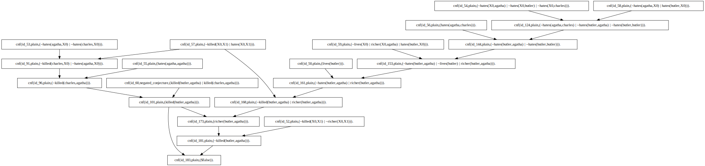

# iProver

iProver is a theorem prover for quantified first-order logic with support for arbitrary precision arithmetic reasoning.

* **[New]** Support for SMT2 and TFF0 formats.
* **[New]** Support for combinations of quantifiers, uninterpreted functions, data types, linear and non-linear arithmetic
  powered by ground reasoning by Z3/MiniSAT and clausification and theory axiomatistions by Vampire.
* **[New]** Superposition, ground joinability, connectedness and AC reasoning (André Duarte)
* **[New]** Machine learning for heuristic optimisation and scheduling -- HOS-ML (Edvard K. Holden).
* **[New]** Interactive mode where iProver can be guided by an external agent, e.g. based on machine learning, via TCP/IP sockets.
 
-------------


Ask questions on [zulipchat](https://iprover.zulipchat.com)

We are keen to hear about your experience with iProver so please drop us a line (konstantin.korovin[@]manchester.ac.uk).

iProver is implemented in OCaml.


------------

- [Features and supported input formats](#user-content-features-and-supported-input-formats)
- [Installation](#user-content-installation)
- [Usage](#user-content-usage)
  - [TPTP multi-core](#user-content-tptp-multi-core)
  - [SMT multi-core](#user-content-smt-multi-core)
  - [iProver-ML interactive mode](#user-content-iprover-ml)
  - [TPTP Finite model finding](#user-content-tptp-finite-model-finding)
  - [QBF/DQBF](#user-content-qbfdqbf)
  - [Output](#user-content-output)
  - [Proof graphs](#user-content-proof-graphs)
- [Build from sources](#user-content-build-from-sources)
- [Major contributors](#user-content-major-contributors)
- [External libraries](#user-content-external-libraries)
- [Additional Info](#user-content-additional-info)
- [Contacts](#user-content-contacts)
- [References](#user-content-references)

-------------

# Features and supported input formats

 * SMT2 all combinations of quantifiers, uninterpreted functions, data types, linear and non-linear arithmetic:
    UF, UFDT, LIA, LRA, NIA, NRA, UFDTLIA, UFDTLIRA, UFDTNIA, UFDTNIRA, UFIDL, UFLIA, UFLRA, UFNIA.
 * First-order theorem proving: TPTP CNF/FOF/TFF0/Prover9 format (TFF/FOF with external clausifiers)
 * Finite model finding 
 * QBF/DQBF: QDIMACS
 * Hardware verification: AIGER 
 * First-order verification: 
   an extension of TPTP for specifying first-order transition systems and verification conditions 
 * Planning: PDDL (in progress)

 
# Installation
## requires python3
## Linux build [iprover-build-linux](https://gitlab.com/korovin/iprover/-/jobs/artifacts/master/download?job=build)
## MacOS build [iprover-build-macos](https://gitlab.com/korovin/iprover/-/jobs/artifacts/master/download?job=build-macos)

# Usage

### TPTP multi-core
   
```shell   
./iproveropt-multi-core.sh -t 300 Examples/problem.p
```

### SMT multi-core

```shell
./iproveropt-multi-core.sh -t 300 Examples/problem_unsat.smt2
```

```shell
./iproveropt-multi-core.sh -t 300 Examples/problem_sat.smt2
```

### Prover9 format

Relies on TranslatorX to be installed: [TranslatorX](https://gitlab.com/cfmsousa/TranslatorX)

If TranslatorX is installed you can call iproveropt-multi-core.sh on Prover9 files in a usual way e.g,:

```shell
./iproveropt-multi-core.sh -t 300 -s ueq_schedule Examples/power-3.p9
```

### TPTP single core

```shell 
./iproveropt Examples/problem.p
```

### TPTP Finite model finding

```shell
./iproveropt --schedule none --sat_mode true --time_out_real 300 --sat_finite_models true Examples/problem_sat.p
```

### QBF/DQBF

```shell
./iproveropt --qbf_mode true --time_out_real 300. Examples/problem.dqbf
```
where problem.qdimacs is a QBF or DQBF problem in qdimacs  


# iProver-ML 
iProver-ML (aka interactive mode) supports proof search guidance with an external agent e.g. based on machine learning.
 The external agent communicates with iProver via TCP/IP sockets and can be written in any language e.g., Python. External agent can be used to provide proof search guidance by either assigning scores to clauses which are used for prioritising them for next inferences or explicitly selecting the given clause for the next inferences. For details see [Readme-interactive](./README-interactive.md)


## Build from sources

1. Install OCaml and the required OCaml packages.

```shell
apt-get install opam 
# brew install opam # for macOS
opam init
opam update
opam switch create 4.14.1+flambda --package=ocaml-variants.4.14.1+options,ocaml-option-flambda
opam install ocamlfind ocamlgraph zarith yojson z3
eval $(opam env) 
```

Note on MacOS you may need to install homebrew and gmp via homebrew:

```shell 
brew install gmp
```

2. check dependencies

```shell
./configure 
```
3. build  

version with Z3 (recommended):

```shell 
make 
```

version without Z3 (in some cases of **macOS**):

```shell
make z3=false
```

compile statically wit Z3

```shell
make STATIC=true z3=true Z3Lib="path to statically compiled z3 lib"
```

compile statically without Z3

```shell
make STATIC=true z3=false
```

4. Run tests 

```shell
./tests_run.sh
```

## Output

Output: the output of iProver is according to a modified version of SZS ontology:

#### % SZS status Unsatisfiable

unsatisfiable set of input formulas where the input does not contain TPTP "theorem" 
(i.e. either cnf or fof and does not contain a conjecture)	

#### % SZS status Satisfiable

satisfiable set of input formulas where the input does not contain TPTP "theorem" 
(i.e. contains neither a "conjecture" or a "negated_conjecture")

#### % SZS status Theorem

theorem is proved where the input is first-order and contains a theorem represented 
by a TPTP "conjecture".

#### % SZS status CounterSatisfiable 

theorem is disproved where the input is first-order and contains a theorem 
represented by a conjecture. 


### Misc output:

#### % SZZ status Unknown 

#### % SZZ status Unknown terminated with satisfiable under incomplete theory axiomatisation

#### % SZS output start CNFRefutation 

    ...... Proof output .....

#### % SZS output end CNFRefutation 

#### % SZS output start Model  

    ...... Model output .....
     
#### % SZS output end Model 

## Proof graphs

Proofs can be also output as a graph in the DOT format and viewed using, e.g., graphviz: 
    
```shell
 ./iproveropt --proof_dot_file proof_file.dot Examples/problem.p
```

Proofs can be reduced  to nodes satisfying one of the properties in the list:

```--proof_reduce_dot <[(unit|all_neg|all_pos)^+]>```

```shell
 ./iproveropt --proof_reduce_dot "[unit;all_neg]" --proof_dot_file proof_file.dot Examples/problem.p
```

If graphviz is installed you can convert .dot to .svg using

```shell
dot -Tsvg proof_file.dot -o proof_file.svg
```

or to .png

```shell
dot -Tpng proof_file.dot -o proof_file.png
```




# Major contributors

Project leader: Konstantin Korovin (konstantin.korovin[@]manchester.ac.uk), The University of Manchester, UK
              
1. Konstantin Korovin: core, instantiation, resolution, finite model finding, preprocessing, indexing, QBF
2. André Duarte: superposition, AC reasoning, simplifications, perfect discrimination trees, SMT/Z3: 
3. Edvard Holden: HOS-ML, parameter tuning, machine learning 
4. Julio César López Hernández: abstraction refinement
5. Dmitry Tsarkov: bounded model checking, k-induction, AIG: 
6. Christoph Sticksel: proofs/unsat cores, bounded model checking
7. Martin Suda: planning

# External libraries 

1. Vampire used for clausification and theory axioms
    Andrei Voronkov, Giles Reger, Laura Kovac, Ahmed Bhayat, Martin Suda, Krystof Hoder, Alexander Riazanov... 
2. MiniSat (ground reasoning) Niklas Een and Niklas Sorensson
3. Z3 (ground reasoning) Nikolaj Bjorner, Leo de Moura, .. 
4. AIG parser: Armin Biere (aig mode) 	   
5. ocamlgraph: Sylvain Conchon, Jean-Christophe Filliâtre, Julien Signoles 
6. Zarith: Antoine Miné, Xavier Leroy, Pascal Cuoq, Christophe Troestler 

# Additional Info

## iProver outputs proofs and models. 

Different representations of models are implemented based on definitions of predicates in term algebra.
  There is also a bit-vector representation of models for problems with additional tff header
  and an AIGER representation (used in hardware verification).

## Possible issues

### Stack overflow

try to increase stack by running in the same shell:
```shell
 ulimit -s 60000 #(Mac)
```
```shell
 ulimit -s 200000 #(Linux)
```
  or 

```shell
iprover_run.sh timelimit problem_name
```

## options file

It might be convenient to collect options you like in a file 
(e.g. example.opt) and run

```shell
./iproveropt $(cat Options/example.opt) Examples/problem.p
```

The default options should be generally ok.

## clean all binaries 

(also run after upgrading compilers etc)
to remove created objects and executable files

```shell
make clean
```

to remove created objects and executable files, cleaning external libraries 
(if there are errors during compilation try this first).

```shell
make clean_all
```


# Contacts

Please send any comments, report bugs to konstantin.korovin[@]manchester.ac.uk

If you are interested in a different from GNU GPL license please email konstantin.korovin[@]manchester.ac.uk

For more info visit [homepage](https://korovin.gitlab.io)

Ask questions on [zulipchat](https://iprover.zulipchat.com)

# License 
This release is licensed under GNU GPL. If you are interested in a different license please email konstantin.korovin[@]manchester.ac.uk

# References

Core iProver references:

* Implementing Superposition in iProver (System Description), André Duarte, Konstantin Korovin, IJCAR 2020. [[pdf]](https://korovin.gitlab.io/pub/iprover_ijcar_app_2020.pdf) [[bib]](https://dblp.org/rec/conf/cade/DuarteK20.html?view=bibtex)
* Ground Joinability and Connectedness in the Superposition Calculus, IJCAR 2022. [[pdf]](https://link.springer.com/content/pdf/10.1007/978-3-031-10769-6_11.pdf) [[bib]](https://dblp.org/rec/conf/cade/DuarteK22.html?view=bibtex)
* Heterogeneous Heuristic Optimisation and Scheduling for First-Order Theorem Proving, Edvard K. Holden, Konstantin Korovin, CICM 2021. [[pdf]](https://korovin.gitlab.io/pub/cicm_2021.pdf) [[bib]](https://dblp.org/rec/conf/mkm/HoldenK21.html?view=bibtex)
* AC Simplifications and Closure Redundancies in the Superposition Calculus, André Duarte, Konstantin Korovin, TABLEAUX 2021. [[springer]](https://link.springer.com/chapter/10.1007/978-3-030-86059-2_12) [[arXiv]](https://arxiv.org/abs/2107.08409) [[bib]](https://dblp.org/rec/conf/tableaux/DuarteK21.html?view=bibtex)
* An Abstraction-Refinement Framework for Reasoning with Large Theories, Julio César López Hernández, Konstantin Korovin, IJCAR 2018. [[pdf]](https://korovin.gitlab.io/pub/abstr_ref_ijcar_2018.pdf) [[bib]](https://dblp.org/rec/conf/cade/HernandezK18.html?view=bibtex)
* Predicate Elimination for Preprocessing in First-Order Theorem Proving, Zurab Khasidashvili, Konstantin Korovin, SAT 2016.  [[pdf]](https://korovin.gitlab.io/pub/pred_elim_sat16.pdf) [[bib]](https://dblp.org/rec/conf/sat/KhasidashviliK16.html?view=bibtex)
* Inst-Gen - A Modular Approach to Instantiation-Based Automated Reasoning, Konstantin Korovin, Programming Logics 2013. [[pdf]](https://korovin.gitlab.io/pub/inst_gen_modular.pdf) [[bib]](https://dblp.uni-trier.de/rec/bibtex/conf/birthday/Korovin13)
* Non-cyclic Sorts for First-Order Satisfiability, Konstantin Korovin, FroCos 2013. [[pdf]](https://korovin.gitlab.io/pub/frocos_non_cyclic_2013.pdf) [[bib]](https://dblp.org/rec/conf/frocos/Korovin13.html?view=bibtex)
* Preprocessing techniques for first-order clausification, Krystof Hoder, Zurab Khasidashvili, Konstantin Korovin, Andrei Voronkov, FMCAD 2012. [[pdf]](https://korovin.gitlab.io/pub/fmcad_2012.pdf) [[bib]](https://dblp.org/rec/conf/fmcad/HoderKKV12.html?view=bibtex)
* A Note on Model Representation and Proof Extraction in the First-Order Instantiation-Based Calculus Inst-Gen, Konstantin Korovin, Christoph Sticksel, ARW 2012. [[pdf]](https://korovin.gitlab.io/pub/arw_2012.pdf) [[bib]](https://korovin.gitlab.io/pub/arw_2012.bib)
* Labelled Unit Superposition Calculi for Instantiation-based Reasoning, Konstantin Korovin, Christoph Sticksel, LPAR 2010, [[pdf]](https://korovin.gitlab.io/pub/lpar_2010.pdf) [[bib]](https://dblp.uni-trier.de/rec/conf/lpar/KorovinS10.html?view=bibtex)
* iProver-Eq: An Instantiation-Based Theorem Prover with Equality, Konstantin Korovin, Christoph Sticksel, IJCAR 2010.
[[pdf]](https://korovin.gitlab.io/pub/ijcar_2010.pdf) [[bib]](https://dblp.org/rec/conf/cade/KorovinS10.html?view=bibtex)
* iProver - An Instantiation-Based Theorem Prover for First-Order Logic (System Description), Konstantin Korovin, IJCAR 2008. [[pdf]](https://korovin.gitlab.io/pub/iprover_descr_08.pdf) [[bib]](https://dblp.uni-trier.de/rec/bibtex/conf/cade/Korovin08)
* Theory Instantiation, Harald Ganzinger, Konstantin Korovin, LPAR 2006. [[pdf]](https://korovin.gitlab.io/pub/theory_inst_lpar06.pdf) [[bib]](https://dblp.org/rec/conf/lpar/GanzingerK06.html?view=bibtex)
* Integrating Equational Reasoning into Instantiation-Based Theorem Proving,  Harald Ganzinger, Konstantin Korovin, CSL 2004. [[pdf]](https://korovin.gitlab.io/pub/inst_eq_csl04.pdf) [[bib]](https://dblp.org/rec/conf/csl/GanzingerK04.html?view=bibtex)
* New Directions in Instantiation-Based Theorem Proving, Harald Ganzinger, Konstantin Korovin, LICS 2003. [[pdf]](https://korovin.gitlab.io/pub/instantiation_lics03.pdf) [[bib]](https://dblp.org/rec/conf/lics/GanzingerK03.html?view=bibtex)

Nueral and ML tuning and guidance:

* Graph Sequence Learning for Premise Selection, E. K. Holden, K. Korovin, 2023 [[arXiv]](https://arxiv.org/abs/2303.15642)
* Machine Learning Meets The Herbrand Universe, J. Piepenbrock, J. Urban, K. Korovin, M. Olsak, T. Heskes, M. Janota,  [[arxiv]](https://arxiv.org/abs/2210.03590) [[bib]](https://dblp.org/rec/journals/corr/abs-2210-03590.html?view=bibtex)
* Heterogeneous Heuristic Optimisation and Scheduling for First-Order Theorem Proving E. K. Holden and K. Korovin, CICM 2021, [[pdf]](https://korovin.gitlab.io/pub/cicm_2021.pdf) [[bib]](https://korovin.gitlab.io/pub/cicm_2021.pdf)
* Premise selection with neural networks and distributed representation of features, A. S. Kucik, K. Korovin, [[arXiv]](https://arxiv.org/abs/1807.10268) [[bib]](https://korovin.gitlab.io/pub/premise_sel_kucik_korovin_2018.bib)
* For fine-grained guidance see above Interactive Mode

# Applications

## Verification (used at Intel)

* EPR-based k-induction with Counterexample Guided Abstraction Refinement, Z. Khasidashvili, K. Korovin and D. Tsarkov, GCAI 2015. [[pdf]](https://easychair.org/publications/open/MF) [[bib]](https://dblp.org/rec/conf/gcai/KhasidashviliKT15.html?view=bibtex) 
* Instantiations, Zippers and EPR Interpolation, N. Bjorner, A. Gurfinkel, K. Korovin, O. Lahav, LPAR'13 [[pdf]](https://korovin.gitlab.io/pub/zipper_interpolants_lpar_2013.pdf) [[bib]](https://dblp.uni-trier.de/rec/conf/lpar/BjornerGKL13.html?view=bibtex)
* EPR-Based Bounded Model Checking at Word Level, M. Emmer, Z. Khasidashvili, K. Korovin, C. Sticksel, A. Voronkov, IJCAR'12. [[pdf]](https://korovin.gitlab.io/pub/bmc_epr.pdf) [[bib]](https://dblp.uni-trier.de/rec/conf/cade/EmmerKKSV12.html?view=bibtex)
* Encoding Industrial Hardware Verification Problems into Effectively Propositional Logic, M. Emmer, Z. Khasidashvili, K. Korovin and A. Voronkov, FMCAD'10. [[pdf]](https://korovin.gitlab.io/pub/fmcad_2010.pdf) [[bib]](https://dblp.uni-trier.de/rec/conf/fmcad/EmmerKKV10.html?view=bibtex)

## Software verification... todo... get involved...

## Biotechnology

* The Robot Scientist Genesis: Abduction for Metabolic Modelling, Alexander H. Gower, Konstantin Korovin, Daniel Brunnsåker, Filip Kronstrom, Gabriel K. Reder, Ievgeniia A. Tiukova, Ronald S. Reiserer, John Wikswo, Ross D. King,
AAAI Spring Symposium on Computational Approaches to Scientific Discovery. [[pdf]](https://cogsys.org/symposium/discovery-2023/abstracts/Abstract_9276.pdf) [[talk]](https://cogsys.org/symposium/discovery-2023/talks/Gower.pdf)

## Ontologies:
* iProver performs well on expressive first-order ontologies: SUMO upper ontology, CYC, etc.

## Higher-order logic
* iProver is intergrated into Isabelle and Leo-III
* Todo: native support.. get involved...

## Mathematics... todo... get involved...


For more references and pdfs please check:
https://korovin.gitlab.io/pub/
